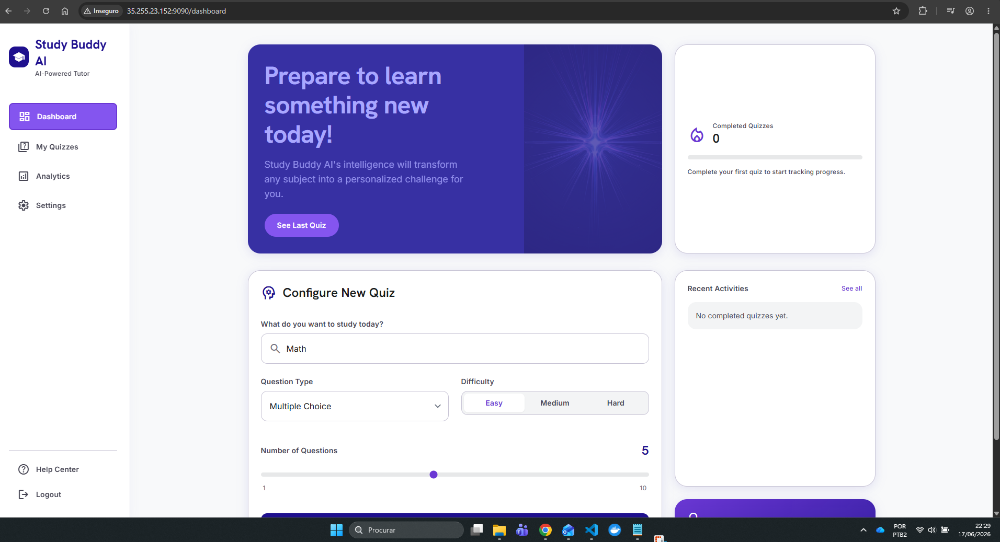
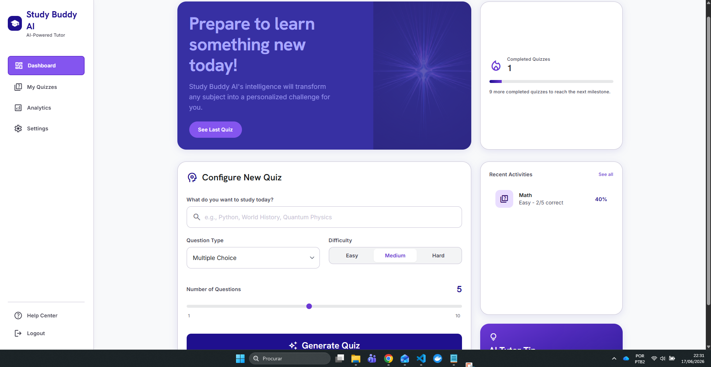
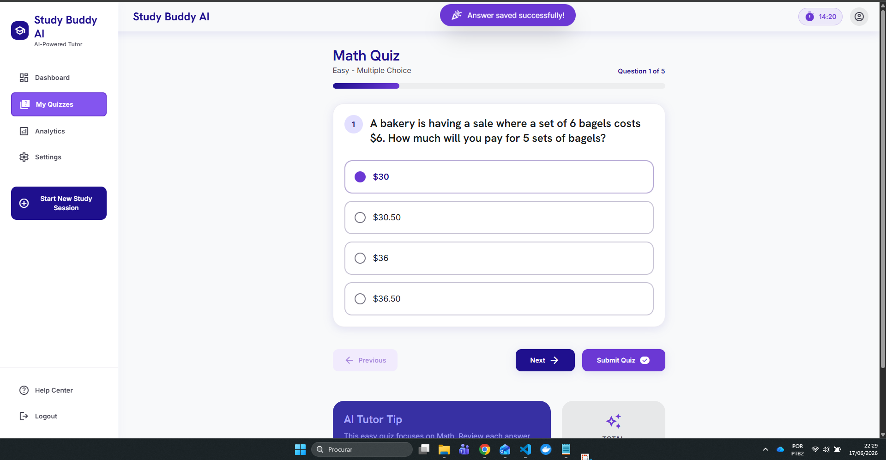
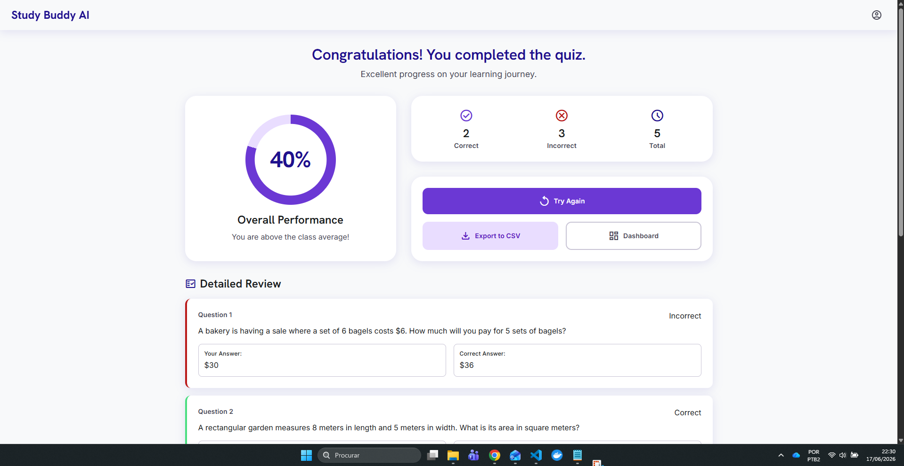
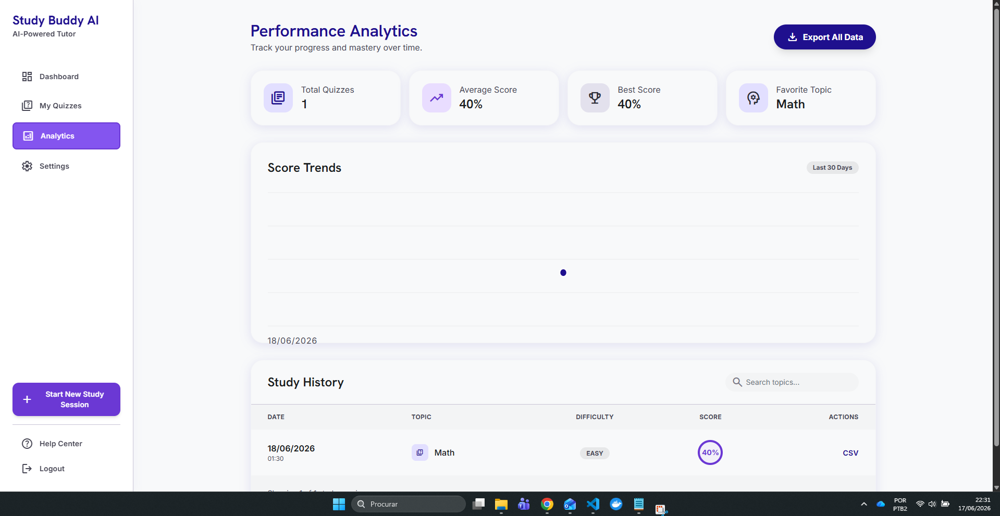
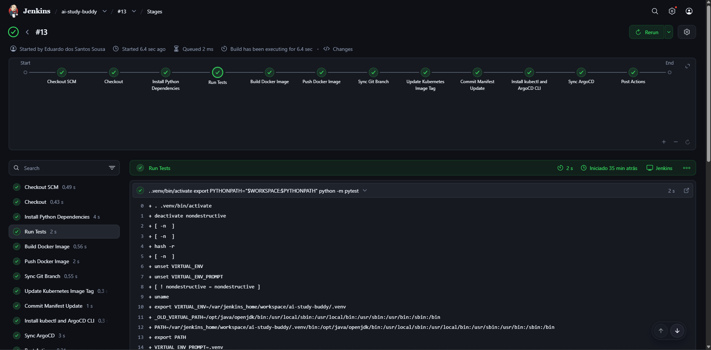
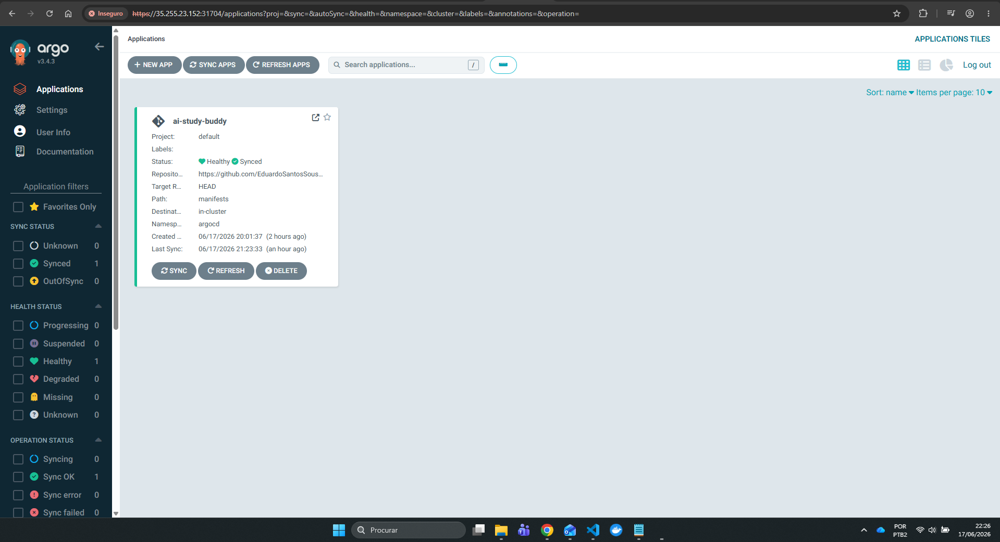
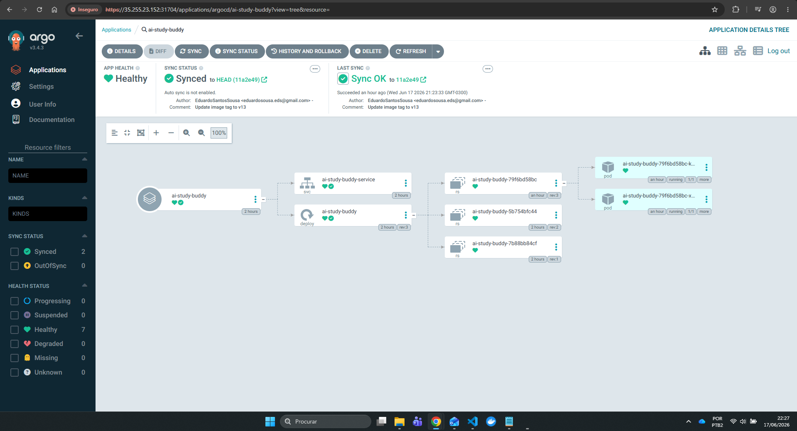

<div align="center">
  

  <h1>Study Buddy AI</h1>

  <p>
    <strong>An AI-powered quiz tutor with a complete CI/CD and GitOps deployment workflow.</strong>
  </p>

  <p>
    <a href="https://youtu.be/MX44ABh2nQk"><strong>Watch the demo video</strong></a>
  </p>

  <p>
    
    
    
    
    
    
  </p>
</div>

---

## Overview

Study Buddy AI is a full-stack learning assistant that generates personalized quizzes, evaluates user answers, tracks performance, and exports study results. The project also demonstrates a production-style delivery pipeline using Jenkins, Docker, Kubernetes manifests, and Argo CD GitOps synchronization.

The application is designed around a practical learning loop:

- Configure a quiz by topic, difficulty, question type, and number of questions.
- Generate AI-powered questions through the backend service.
- Answer questions in a clean quiz interface.
- Review score, correct answers, and detailed feedback.
- Track progress over time through analytics and CSV exports.
- Deploy every validated change through an automated CI/CD workflow.

## Demo

▶️ **Video demonstration:** [https://youtu.be/MX44ABh2nQk](https://youtu.be/MX44ABh2nQk)

The repository also includes a local demo video asset:

```text
img_READ_ME/ai_studdy_buddy_app.mp4
```

## Application Preview

### Dashboard and Quiz Configuration

The dashboard gives the learner a starting point for a new study session, with quiz setup controls and recent activity.



After completing a quiz, the dashboard summarizes recent progress and completed sessions.



### Quiz Experience

The quiz page presents one question at a time with clear answer choices, progress tracking, navigation, and submission controls.



### Results and Review

After submission, the learner receives an overall score, correct and incorrect totals, and a detailed review of each question.



### Performance Analytics

The analytics page tracks study history, average score, best score, favorite topic, and CSV export options.



## DevOps Preview

### Jenkins Pipeline

The Jenkins pipeline validates the application, builds the Docker image, pushes it to Docker Hub, updates the Kubernetes manifest image tag, commits the manifest update, and triggers Argo CD synchronization.



### Argo CD GitOps

Argo CD tracks the Kubernetes manifests from the repository and keeps the application synchronized with the desired state.



The resource tree shows the deployed service, deployment, replica sets, and running pods.



## Features

| Area | Capabilities |
| --- | --- |
| 🧠 AI quiz generation | Generate quiz questions by topic, difficulty, and question type. |
| 📝 Interactive quizzes | Answer multiple-choice questions in a focused study interface. |
| 📊 Analytics | Track total quizzes, average score, best score, favorite topic, and historical results. |
| 📤 CSV exports | Export individual session results and complete analytics data. |
| ⚡ FastAPI backend | REST API for quiz generation, submission, analytics, exports, and health checks. |
| 🗃️ SQLite persistence | Store quiz sessions, submitted answers, results, and analytics summaries. |
| 🐳 Docker support | Containerized application image for reproducible deployment. |
| 🚀 Jenkins CI/CD | Automated test, build, push, manifest update, and deployment sync pipeline. |
| ☸️ Kubernetes manifests | Deployment and service definitions for cluster deployment. |
| 🔁 Argo CD GitOps | Declarative synchronization from Git to Kubernetes. |

## Tech Stack

| Layer | Technology |
| --- | --- |
| Backend | Python, FastAPI, Pydantic |
| AI integration | LangChain, Groq |
| Frontend | HTML, CSS, JavaScript, Jinja2 templates |
| Storage | SQLite |
| Testing | Pytest, FastAPI TestClient |
| Containerization | Docker |
| CI/CD | Jenkins Pipeline |
| Deployment | Kubernetes, Argo CD |

## Architecture

```text
User Browser
    |
    v
FastAPI Application
    |
    +-- Frontend templates and static assets
    +-- Quiz API endpoints
    +-- Analytics and CSV export endpoints
    |
    v
Quiz Services
    |
    +-- LangChain + Groq question generation
    +-- Answer evaluation
    +-- Public question formatting
    |
    v
SQLite Storage
```

### CI/CD and GitOps Flow

```text
GitHub Repository
    |
    v
Jenkins Pipeline
    |
    +-- Checkout source code
    +-- Install Python dependencies
    +-- Run pytest
    +-- Build Docker image
    +-- Push image to Docker Hub
    +-- Update Kubernetes image tag
    +-- Commit manifest update to GitHub
    |
    v
Argo CD
    |
    +-- Detect manifest change
    +-- Sync Kubernetes resources
    |
    v
Kubernetes Cluster
```

## Project Structure

```text
AI-Study-Buddy/
├── backend/
│   ├── app.py              # FastAPI routes and web pages
│   ├── schemas.py          # Request and response models
│   ├── services.py         # Quiz generation and evaluation logic
│   └── storage.py          # SQLite persistence layer
├── frontend/
│   ├── assets/             # CSS and static assets
│   ├── js/                 # Client-side page logic
│   └── templates/          # Jinja2 HTML templates
├── src/
│   ├── config/             # Application settings
│   ├── generator/          # Question generator
│   ├── llm/                # Groq client integration
│   ├── models/             # AI output schemas
│   └── prompts/            # Prompt templates
├── manifests/
│   ├── deployment.yaml     # Kubernetes deployment
│   └── service.yaml        # Kubernetes service
├── tests/
│   └── test_quizzes.py     # API tests
├── img_READ_ME/            # README images and demo assets
├── Dockerfile
├── Jenkinsfile
├── requirements.txt
└── setup.py
```

## API Endpoints

| Method | Endpoint | Description |
| --- | --- | --- |
| `GET` | `/api/health` | Health check endpoint. |
| `POST` | `/api/quizzes/generate` | Generate a new quiz session. |
| `POST` | `/api/quizzes/submit` | Submit answers and receive score details. |
| `GET` | `/api/analytics/summary` | Return analytics summary and study history. |
| `GET` | `/api/exports/session/{session_id}.csv` | Export one quiz session as CSV. |
| `GET` | `/api/exports/all.csv` | Export all analytics data as CSV. |

## Running Locally

### 1. Clone the repository

```bash
git clone https://github.com/EduardoSantosSousa/AI-Study-Buddy.git
cd AI-Study-Buddy
```

### 2. Create a virtual environment

```bash
python -m venv .venv
source .venv/bin/activate
```

On Windows PowerShell:

```powershell
python -m venv .venv
.venv\Scripts\Activate.ps1
```

### 3. Install dependencies

```bash
pip install --upgrade pip
pip install -r requirements.txt
```

### 4. Configure environment variables

Create a `.env` file in the project root:

```env
GROQ_API_KEY=your_groq_api_key_here
```

### 5. Start the application

```bash
uvicorn backend.app:app --host 0.0.0.0 --port 8000 --reload
```

Open:

```text
http://localhost:8000
```

## Running Tests

```bash
export PYTHONPATH="$PWD:$PYTHONPATH"
python -m pytest
```

On Windows PowerShell:

```powershell
$env:PYTHONPATH = "$PWD;$env:PYTHONPATH"
python -m pytest
```

## Docker

Build the image:

```bash
docker build -t eduardosousa1493/ai-study-buddy:local .
```

Run the container:

```bash
docker run --rm -p 8000:8000 --env-file .env eduardosousa1493/ai-study-buddy:local
```

## Kubernetes Deployment

The Kubernetes manifests are stored in:

```text
manifests/
```

Apply them manually:

```bash
kubectl apply -f manifests/
```

The deployment expects a Kubernetes secret named `groq-api-secret` with the key `GROQ_API_KEY`:

```bash
kubectl create secret generic groq-api-secret \
  --from-literal=GROQ_API_KEY="your_groq_api_key_here" \
  -n argocd
```

## Jenkins Pipeline

The pipeline is defined in `Jenkinsfile` and performs:

1. Checkout from GitHub.
2. Python dependency installation.
3. Test execution with `pytest`.
4. Docker image build.
5. Docker Hub push.
6. Kubernetes manifest image tag update.
7. Manifest commit back to GitHub.
8. Argo CD CLI sync.

Required Jenkins credentials:

| Credential ID | Type | Purpose |
| --- | --- | --- |
| `github-token` | Username with password/token | Checkout and push manifest updates. |
| `dockerhub-token` | Username with password/token | Docker Hub login and image push. |
| `kubeconfig` | Secret text | Base64-encoded flattened kubeconfig. |

Generate the `kubeconfig` secret text from the machine where `kubectl` works:

```bash
kubectl config view --raw --flatten --minify | base64 -w 0
```

## Argo CD

Argo CD watches the repository manifests and synchronizes the application into Kubernetes. The application uses:

```text
Application: ai-study-buddy
Manifest path: manifests
Namespace: argocd
```

## Environment Variables

| Variable | Description |
| --- | --- |
| `GROQ_API_KEY` | API key used by the Groq/LangChain question generation flow. |

## Notes

- Tests mock the AI generation path so CI remains deterministic and does not depend on external LLM calls.
- The image tag is generated from the Jenkins build number using `v${BUILD_NUMBER}`.
- Argo CD sync is triggered after the manifest image tag is committed back to GitHub.

## Author

Built by **Eduardo dos Santos Sousa** as part of an end-to-end LLMOps and AIOps learning project.
